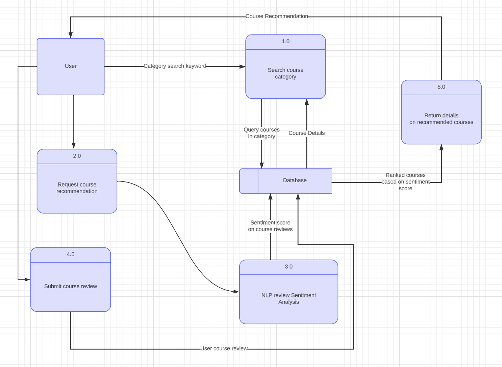
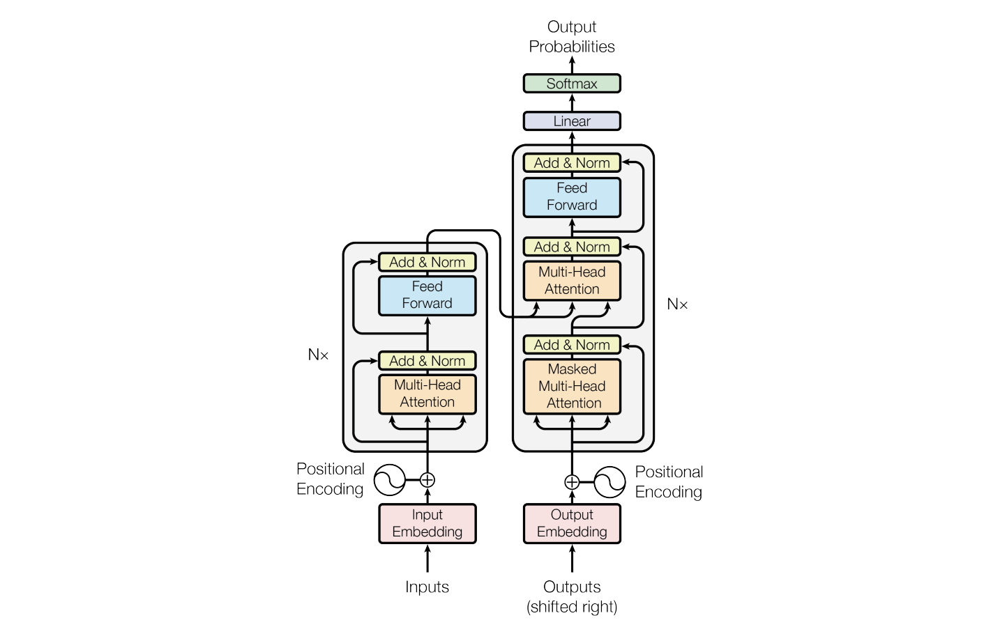
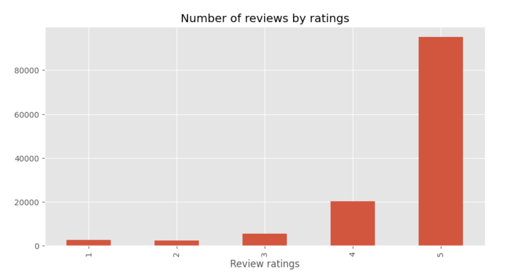
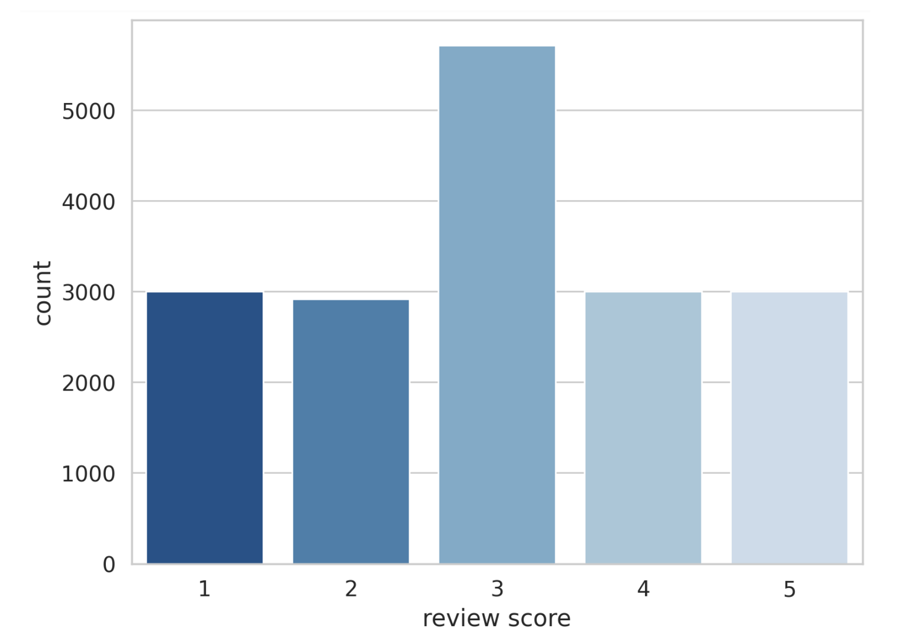
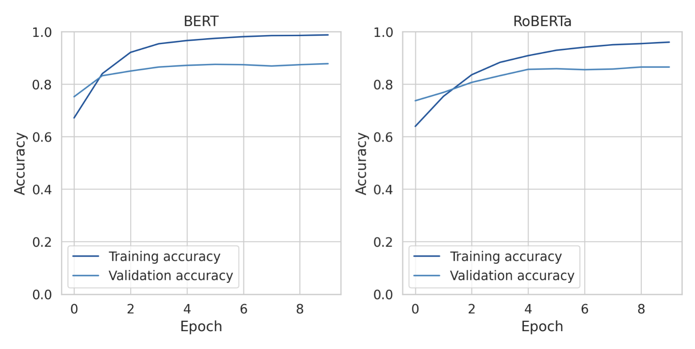
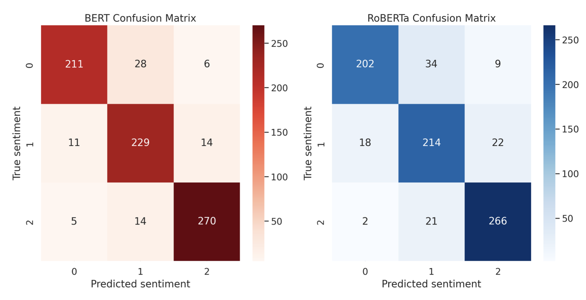
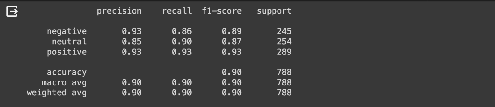
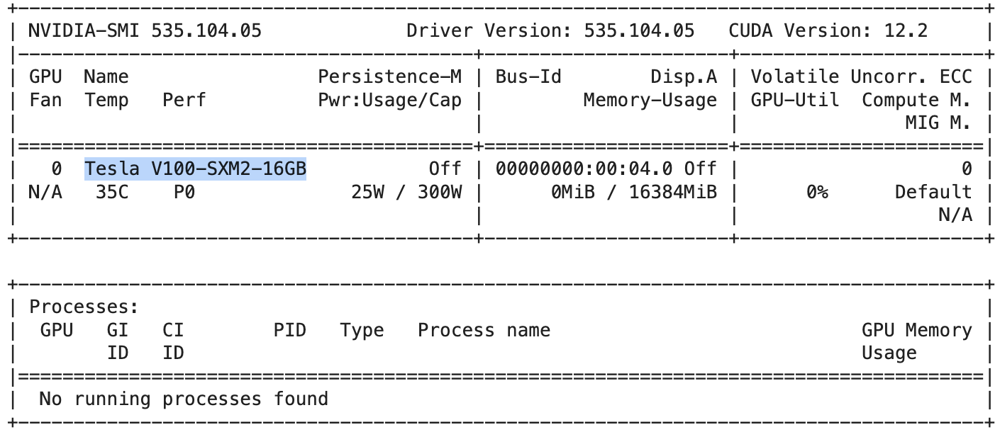
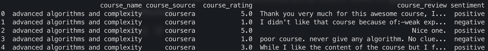

# Course Recommendation using Natural Language Processing (NLP)

### Introduction
This project aims to recommend courses based on reviews of previous course takers by classifying **positive**, **neutral** and **negative** sentiments using a fine-tuned LLM for sentiment classification. The project compares the performance of LLMs like **BERT** and **RoBERTa**.

### The Architecture
---
The pre-trained LLMs used in this project are built on top of the Transformer architecture. Introduced in a paper by [Vaswani et al., 2017](https://proceedings.neurips.cc/paper/2017/file/3f5ee243547dee91fbd053c1c4a845aa-Paper.pdf), at their core, they are known for their self-attention mechanisms, which allow the model to weigh the importance of different words in a sequence enhancing the model's understanding of each word's context. Transformers process input data in parallel and don’t rely on sequential processing like traditional
**Recurrent Neural Networks (RNNs)**.

They have been implemented in various pre-trained models that serve as a foundation for many NLP tasks. Examples of these pre-trained models include, **Bi-directional Encoder Representations from Transformers (BERT)** which is pre-trained on a massive text corpus understanding each word's context bi-directionally, leading to state-of-the-art results in tasks like sentiment analysis, question answering, and more.

### Data Aquisition
---
The project makes use of datasets from three different sources. We acquired a publicly available course review dataset on coursera courses and combined it with scraped course reviews from Udacity to have course reviews from two different MOOC platforms. We also scraped mobile app reviews to use for training the model on sentiment classification.

### Training and Validation
---
**Training** 
The existing course review dataset was highly imbalanced since it is biased towards positive reviews as shown in the visualization below. Most of the reviews are categorized under a rating of 5 which makes it unreliable for training.

Since all we are interested in is capturing sentiment from text, we used the mobile app review dataset as a work-around, which has more than enough reviews on each rating category. It was acquired through scraping with the help of the google play scraper library which enabled us to carefully filter and sort the reviews based on the rating score of the applications. This was paramount in creating a balanced dataset that is reliable for re-training/fine-tuning the model for sentiment classification.

**Validation** 
The training and validation history from the visualization below show that both models performed relatively well in classifying text sentiments with BERT registering slightly better results.

We also visualize the confusion matrix just to see how the models performed in predicting each sentiment class. With the positive sentiment represented as 0, neutral sentiment represented as 1 and negative sentiment represented as 2, we notice that both models did relatively well classifying positive and negative sentiments but had much more trouble classifying the neutral sentiments. We also notice from a glance that the BERT model performed better than the RoBERTa model at predicting each class.

The model we ended up selecting was BERT as it registered slightly better performance metrics on the sentiment classification in comparison to RoBERTa

### Assumption and challenges
---
**Assumptions** 
- One of the assumptions made during model training is that negative sentiment reviews are more likely to have a rating of below 3, neutral sentiment reviews are more likely to have a rating of 3 and positive ones are more likely to have a rating greater than 3

- Another assumption made on application deployment is that course popularity is denoted by the total number of reviews recorded on a given course from it's respective platform

**Challenges** 
- Some MOOCs don't have course review data publicly accessible for analysis which limited the amount of data that could be captured sustaibably

- There are no publicly available APIs to efficiently and dynamically retrieve and/or update the analysis of the course reviews.

- Re-training or Fine-tuning LLMs for a specific task is computationally demanding in both time and computational resources

### Results
---
The end product was a fine-tuned sentiment classifier, saved and restored to be used in an intergrated application to predict sentiment classes on new course review data and a labelled dataset on reviews' sentiments, persisted into a MySQL database.

